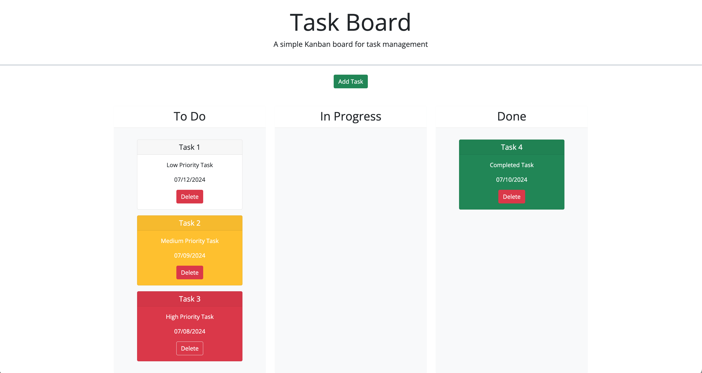

# Task-Board

## Descritpion

This project is a personal todo list task board. Tasks can be added using a form modal and a calender date picker. If due dates are nearing their deadline or past due the task will display in either a yellow or red card. Cards are draggable between the status lanes of todo, in progress, and done. Once a card is dropped in the done lane its color will display green. Tasks are stored to the local storage, retrieved upon page loading, and then render and remain on the page even after refreshing.

## Mock-Up

The following is a mock-up of the board:

## Links

The board has been deployed below:

[Task Board](https://justmacn.github.io/Task-Board/)

## Credits

N/A